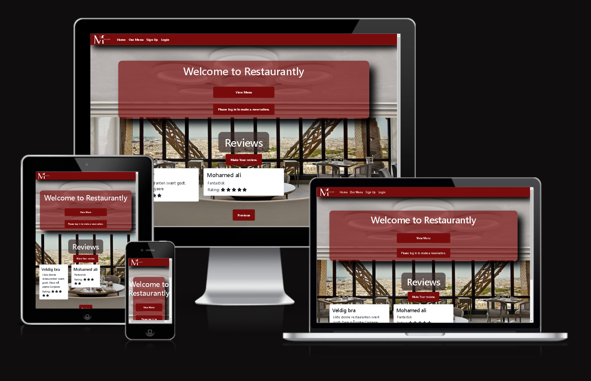

# Resturantly
---

Introducing Restaurantly, a digital haven for food enthusiasts seeking a delightful dining experience. Embark on a culinary journey like no other as you explore our meticulously crafted menus, brimming with tantalizing flavors and exquisite dishes. Whether you're craving comforting classics or adventurous culinary creations, Restaurantly promises to satisfy your palate with an array of mouthwatering options.
But Restaurantly is more than just a menu showcase. It's a vibrant community hub where patrons can share their gastronomic adventures, leaving behind insightful reviews and recommendations to guide fellow food adherents. Dive into a sea of culinary insights, discovering hidden gems and must-try delicacies curated by our passionate community of diners.
And that's not all. With Restaurantly, booking a table is as effortless as a few clicks. Simply sign up and log in to reserve your spot at your favorite eateries, ensuring a seamless dining experience from start to finish. Say goodbye to waiting in long queues or struggling to secure a reservation – with Restaurantly, your table awaits, ready to host your next unforgettable dining escapade.
So whether you're planning a romantic dinner for two or a celebratory feast with friends, let Restaurantly be your trusted companion in the pursuit of culinary excellence. Join us today and embark on a culinary adventure like never before.
You can access the Restaurantl app [here](https://rbs-6abef8d317f3.herokuapp.com/).

# Project

## objectives
The genesis of Restaurantly sprang from a personal odyssey intertwined with my fervor for culinary exploration and fostering community connections. Transitioning from a recreational pursuit to a dedicated developer, I found myself immersed in the realm of gastronomy, spurred on by my children's engagement in local activities.
Observing the hurdles encountered by individuals seeking compatible partners for various endeavors, I discerned an opportunity to apply my technical proficiency to bridge this gap. Inspired by the seamless functionality of online booking systems, I envisioned a platform that merges the convenience of digital reservations with the conviviality of a thriving culinary community.
With Restaurantly, my foremost aim was to leverage my expertise in HTML, CSS, JavaScript, Python, Bootstrap, and the Django Framework to craft a dynamic digital space that enhances the dining experience while fostering meaningful connections within the gastronomic landscape. Though the initial implementation may not have fully realized the aspirations for certain features, I am dedicated to refining and iterating upon them in subsequent versions.
Ultimately, Restaurantly aspires to redefine the way patrons engage with dining establishments, offering a seamless fusion of culinary discovery, reservation convenience, and communal interaction. As I continue to enhance the platform, my unwavering objective remains: to equip food enthusiasts with a comprehensive toolkit for navigating the rich and diverse world of culinary experiences.

### Site User's Goal:
Website User´s goal

Aim to enjoy a hassle-free and convenient dining experience, where they can effortlessly browse menus, make reservations, and access essential information about restaurants.
### Site Owner's Goal

A primary objective is to drive business growth for participating restaurants by increasing their visibility, attracting new customers, and facilitating repeat costumer, by offering compelling features, such as interactive menus, review functionalities, and community forums, to keep users coming back to the platform.

# User Experience (UX)
---

## Primary Goal
The primary objective of this application is to enable registered customers to book tables for their dining experience at our restaurant

### Visitor Goals
As a visitor to the  restaurant's website, you can effortlessly make reservations for a convenient dining time.

#### First Time Visitor

   -  Explore the three main features of our website: Find a table, Make a reservation.
   - Users can sign in and reserve tables
   -  Register, log in, and log out seamlessly.
  -  A user can view their profile and manage reservations by updating or deleting them.

#### Returning Visitor

- Signing in allows users convenient access to the majority of the website's features

### User Stories
- As a customer, I can visit the homepage of my favorite restaurant so that I can view the services provided.

- As a registered user, I want to easily sign in to my account to access the website's features and options seamlessly.
- As a user, I can easily locate the navigation area no the website so that I can access different parts of it without hassle.

- As a user, I can view the menu

- As a logged-in user, I want the ability to log out of my account to maintain its privacy and security.

- As a diner, I can edit my reservation to update my booking details.

- As a diner, I can read and add reviews for the restaurant
- As a user I can enter my personal details so that I can create an account with on the webside and be contacted in case of need
- As a customer, when I land on the login page directly, I can see a visible signup button so that I can easily create a new account if I'm not already registered

- As a registered diner, I can make a reservations for table so that I can So that I can secure a spot for dining at the restaurant.

- As a registered diner, I can cancel my table reservation so that I can free up the table and inform the restaurant.

- As a guest user, I want to register on the website to access its functionality and content.

- As a registered diner, I can cancel my table reservation so that I can free up the table and inform the restaurant.

# Creation Process

In setting up my restaurant's online presence, I aimed for a user-friendly platform that would make booking easy and enhance the dining experience. Inspired by successful restaurant websites, I worked on creating a digital space that mirrored the vibe of my establishment.

I paid close attention to detail, focusing on features like simple reservation systems and appealing menu displays. Each step of the development process aimed to make the online experience as smooth and enjoyable as dining in person.

With each improvement, I kept the goal of providing top-notch service at the forefront. My restaurant's website became more than just a tool; it became a reflection of our commitment to delivering a memorable dining experience, whether online or in-person.

The wireframes encompass desktop, tablet, and mobile views with responsiveness in mind. Most basic pages maintain consistency across all devices (such as sign-in, sign-up, logout, forms, etc.). However, for those with varying layouts on smaller screens, I developed sample wireframes. The primary distinction on smaller screens is a condensed NavBar, accessed through a hamburger icon, and a footer where items stack vertically. .

[Figma](https://www.figma.com) proved invaluable for crafting these wireframes.

 Home Page 

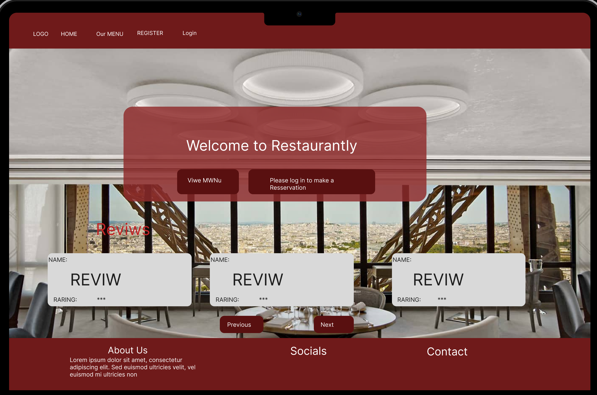

 Menu 

 Sign Up 

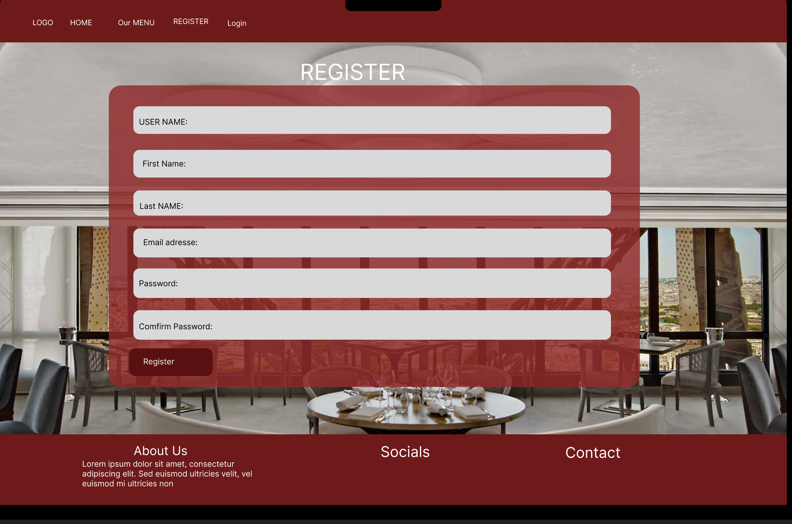

 Login 

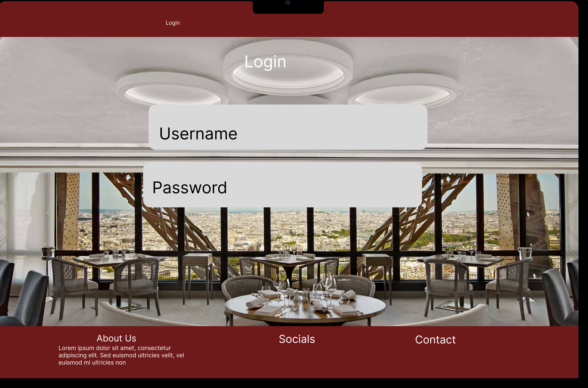

 Profile 

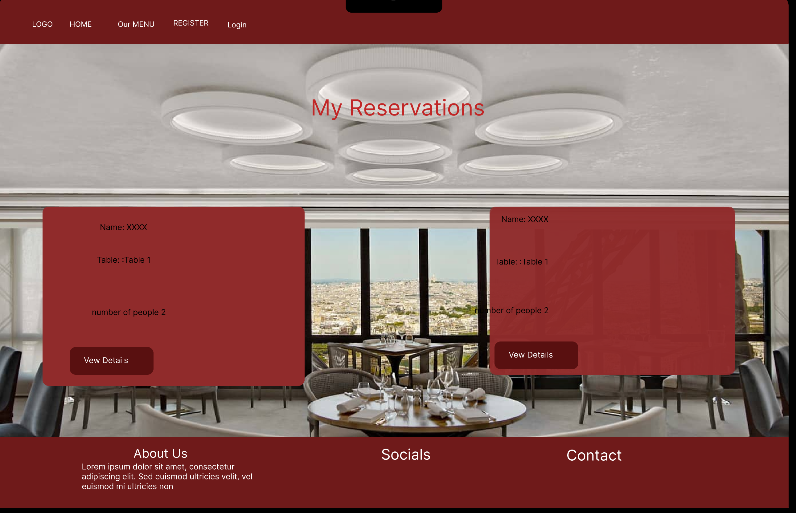

 Make a reservation 

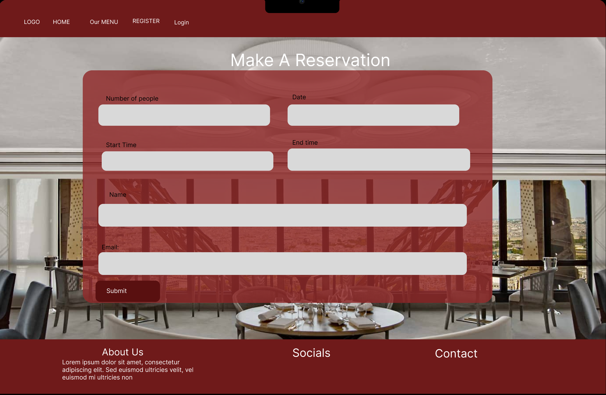

## Project Management

Due to time constraints, I didn't have the opportunity to utilize multiple sprints for my project. However, I made the most of the time available to me, leveraging GitHub Projects for organization, tracking user stories, and managing epics. This tool proved indispensable, allowing me to centralize all Product Backlog Items (PBIs) and approach them methodically.

Initially, I dedicated significant effort to project planning, meticulously crafting wireframes and model sketches. These served as essential references throughout the project, guiding me through each step. As I progressed, I documented PBIs, Epics, and User Stories, transitioning to the Kanban board in GitHub Projects for seamless organization. Milestones were used to delineate the project's progress and serve as sprint markers, despite only having one sprint due to time constraints.

In the absence of multiple sprints, I approached each task strategically, prioritizing essential features while keeping the Minimum Viable Product (MVP) in mind. This involved ensuring backend functionality was robust before incorporating additional features. Despite the limitations on sprint iterations, I remained adaptable, adjusting plans as needed to accommodate unforeseen challenges or complexities, such as those encountered during the implementation of the booking system.

Breaking the project into Epics, User Stories, and tasks proved invaluable, enabling me to manage the workload effectively. Each user story was meticulously labeled and categorized, ensuring clarity and prioritization. Acceptance criteria were established for each user story, guiding the definition of completion and facilitating thorough task fulfillment.

While the project's timeline was constrained, the focus remained on delivering a high-quality product within the given parameters. This necessitated careful prioritization, strategic decision-making, and a flexible approach to project management. Despite the challenges posed by limited time, the experience gained serves as a valuable lesson in efficient project execution and adaptation to constraints.

## Moscow Prioritization

I attempted to implement MoSCoW principles in my development approach, albeit more at a project level rather than within specific sprints. Initially, my primary focus was on fulfilling must-have user stories during the early stages of development. Once the core features were adequately implemented, I began integrating should-haves and could-haves into the project. Additionally, as I progressed, I identified won't-haves, which were either abandoned entirely or earmarked for future iterations of development.

- Must Have: must be delivered (max 60% of user stories)
- Should Have: add significant value, but not crucial (20% of stories)
- Could Have: small impact if not implemented (20% of stories)
- Won't Have: not crucial for this iteration

## Site Structure
The website's appearance adjusts based on the user's sign-in status. When not signed in, users can view Register/Login buttons, while signed-in users can access Profile/Logout buttons.
## Design Choices
To enhance simplicity and attractiveness, the website was designed with a focus on clarity. The color palette was deliberately restrained.

## Color Scheme

Regarding the color scheme, typically I would rely on a color scheme or wheel. However, in this instance, I utilized the color code rgb(120, 12, 12) predominantly throughout the site. The only deviation from this was adjusting the color of the pop-up messages to harmonize with this chosen palette.

## Typography
Initially, I intended to modify the default font type provided. However, after experimenting with various fonts, I found that the original Bootstrap font suited the design well. Consequently, I decided against making any alterations to the font selection.

## Features

#### Responsive Navigation Bar

The site features a straightforward yet efficient NavBar that facilitates user navigation. It includes the following links:

- logo

- Home Page
- Menu
- sign up
- login
- profile
- make a reservation
- logout

 Hamburger Open 

## Home Page

 Home 

## Menu

 Menu 

### sign Up

 Sign Up

### login

 Login 

### Profile

 Profile

### add review

 Review 

### Make A reservation

 Make A reservation 

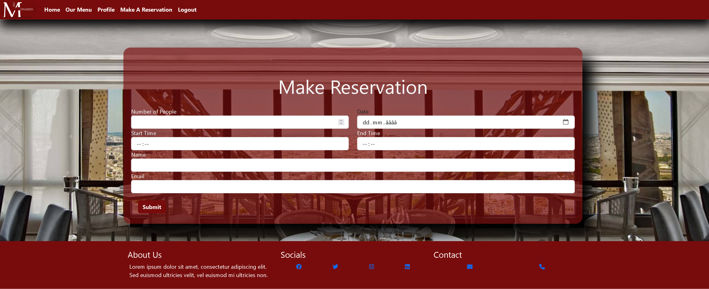

### Reservation Details

 Reservation Details 

### Update Reservation

Update 

### Delete

 Delete 

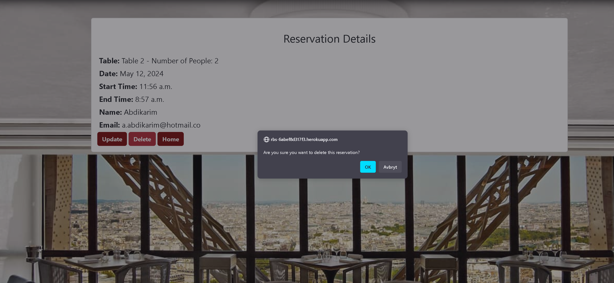

# Technologies Used

### Languages

-  Python - adds functionality.
 - HTML - provides content and structure.
- CSS - styles the website.
- JavaScript - JavaScript makes it interactive.

### Frameworks and Software

- Bootstrap - A CSS framework for building responsive, mobile-first websites.

- Django - The MVT (Model-View-Template) framework used to create the website.
- Figma - Used to create wireframes.
- Github - hosting the repository.
- Projects in GitHub - Used for project managament.
- Heroku -  deploying the application.
- VS code  -  for developing the application.
- Favicon Converter - used to create a favicon in correct format.
- Lighthouse - Used to test performance of site.
- Responsive Design Checker - Used for responsiveness check.
- Google Chrome DevTools - for debuggin and test responsiveness.
- Cloudinary - for hosting all static files in the project.
- HTML Validation -  validate HTML code
- CSS Validation -  validate CSS code

# Python Packages

Here are the packages and libraries installed and listed in the requirements.txt file:

- asgiref==3.8.1
- cloudinary==1.40.0
- dj-database-url==2.1.0
- Django==5.0.4
- django-cloudinary-storage==0.3.0
- gunicorn==22.0.0
- pillow==10.3.0
- psycopg2==2.9.9
- python-decouple==3.8
- sqlparse==0.5.0
- whitenoise==6.6.0

### Install Django and the supporting libraries
For installing Django and its supporting libraries, execute the following commands:

- pip3 install 'django<4' gunicorn
- pip3 install dj_database_url psycopg2
- pip3 install dj3-cloudinary-storage

Once Django and its accompanying libraries are installed, the next step is to create a requirements file.

- pip3 freeze --local > requirements.txt - This process will generate and incorporate the necessary libraries into a requirements.txt file.

  requirements.txt file 

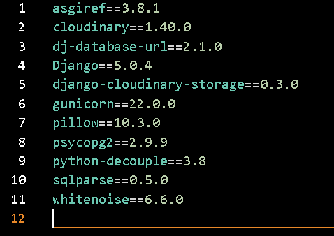

Create the project.

- django-admin startproject YOUR_PROJECT_NAME . - This will create your project

  Create Project 

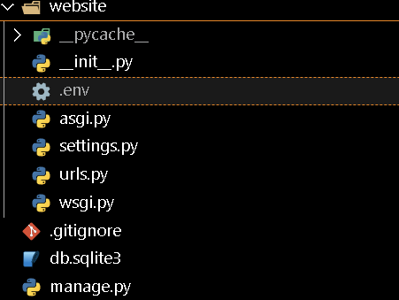

When the project is created, we create the application.
- django-admin startapp APP_NAME - This will create your application

  Create Application 

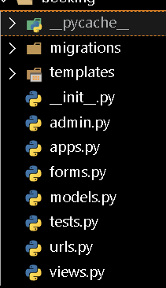

-  To create a superuser type in the following code: python3 manage.py createsuperuser

- To create a superuser type in the following code: python3 manage.py createsuperuser
 -   You will be asked to enter credentials after which the superuser is created

We now need to add the application to settings.py

 Add Application to settings.py 

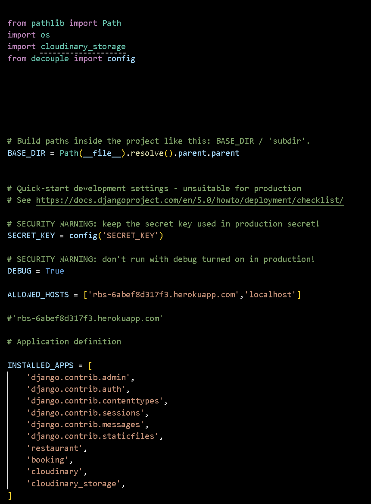

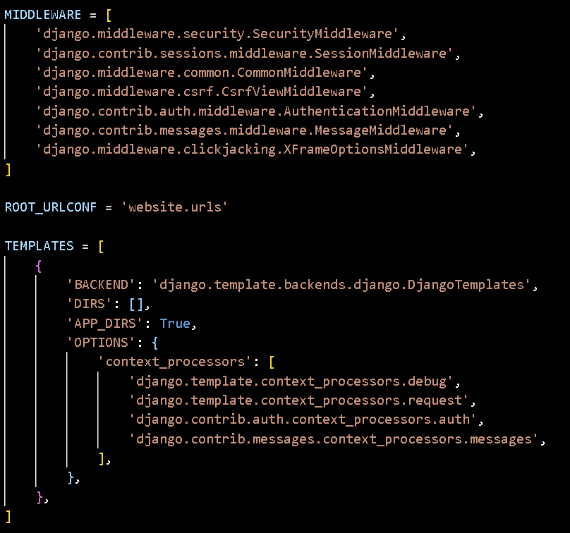

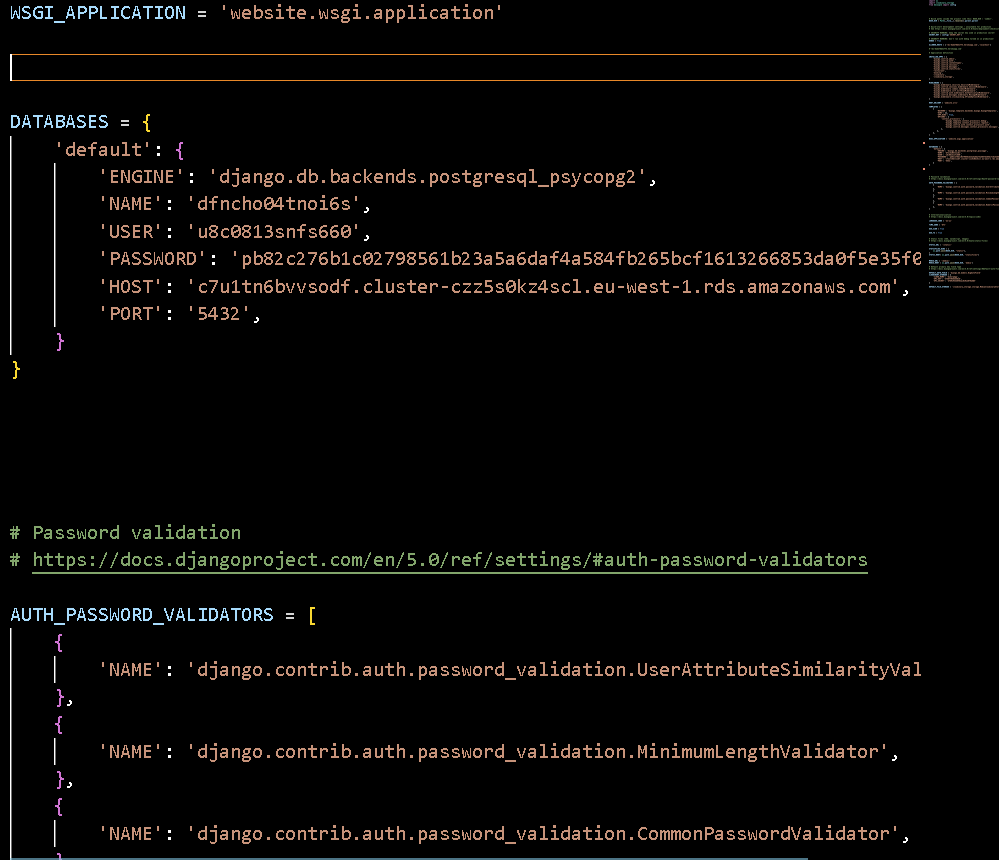

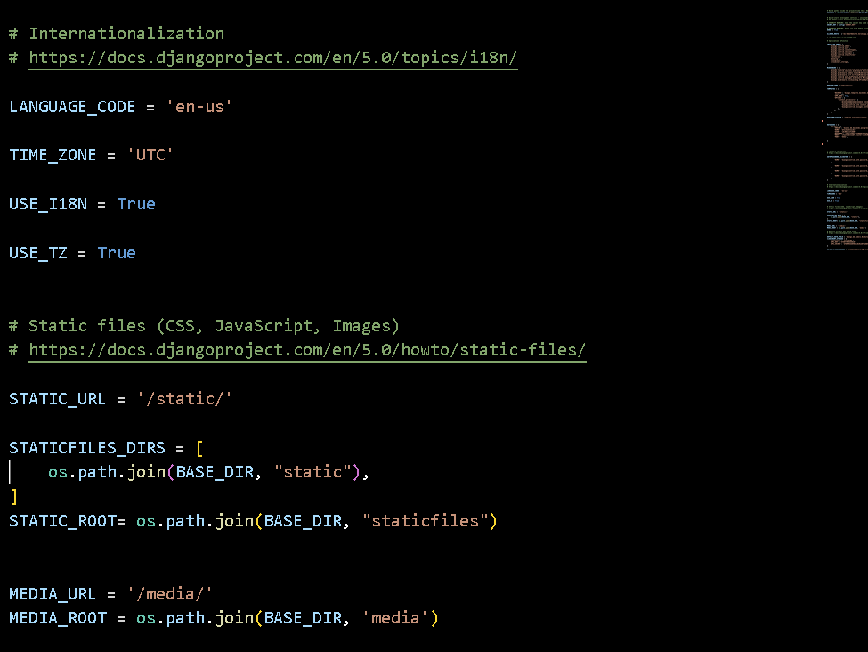

Now do your first migration and run the server to test that everything works as expected. This is done by writing the commands below.

- python3 manage.py migrate - This will migrate the changes.
- python3 manage.py runserver - This runs the server. To test it, click the 'open browser' button that will be visible after the command is run.

Create env.py file at the root level and include the following environment variables. Don't forget to add the env.py file in the .gitignore in order to keep your secret information from becoming unsafe:

SECRET_KEY=ih%(k2k!!h_4k8wbfa=wd!-m9%tq@sqo7((*$7bd_r01vu-@nv)))

from pathlib import Path
import os
import cloudinary_storage
from decouple import config

Add Cloudinary Libraries to the "INSTALLED_APPS" in the following order (the order must be adhered to):

 Add Application to settings.py 

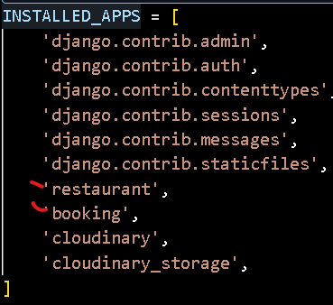

# ElephantSQL Database

ElephantSQL is used for the  heroku's PostgreSQL database in this project.

To create your own PostgreSQL database on Heroku for your project:

- Go to the Heroku dashboard.
- Navigate to your project.
- Find and click on the "Resources" tab.
- In the "Add-ons" section, search for "Heroku PostgresSQL".
- Select the appropriate option from the search results.
- Click on the add-on to open it.
- Inside the Heroku PostgreSQL add-on dashboard, navigate to the "Settings" or "Details" tab.
- You should find the connection details such as the database URL, username, and password.
- Make note of these details for use in configuring your application.
- Your PostgreSQL database is now set up and ready to be used in your Heroku project.

# Cloudinary API
Cloudinary API is used to store media assets online
# Heroku Deployment
To deploy the project to Heroku, please follow these steps:

 - Sign up/Login to Heroku: If you haven't already, sign up for a Heroku account and log in to the dashboard.

- Install Heroku CLI (Command Line Interface): If you haven't installed the Heroku CLI, download and install it from the official Heroku website.

- Prepare your Project: Ensure your project is ready for deployment. This includes setting up a requirements.txt file and a Procfile if necessary. These files specify the dependencies and commands needed to run your application on Heroku.

- Initialize a Git Repository: If your project is not already a Git repository, initialize one by running git init in your project directory.

- Login to Heroku CLI: In your terminal or command prompt, log in to Heroku CLI by running heroku login and following the prompts.

- Create a New Heroku App: Run heroku create in your project directory to create a new Heroku app. This will also add a new remote to your Git repository.

-  Deploy your Code: Push your code to the Heroku remote repository by running git push heroku master. This will deploy your application to Heroku.

- Scale your App (Optional): You may need to scale your application's dynos (containers) to ensure it can handle incoming traffic. You can do this using the Heroku CLI or through the Heroku dashboard.

- Set Config Variables (Optional): If your application requires environment variables, you can set them using the Heroku CLI or through the Heroku dashboard.

- Monitor your App: Once deployed, monitor your application's logs and performance through the Heroku dashboard or CLI.

- Test your App: After deployment, thoroughly test your application to ensure it's functioning correctly in the Heroku environment.

# To fork the repository on GitHub

-  Log in to GitHub: If you haven't already, log in to your GitHub account.

-  Navigate to the Repository: Go to the repository you want to fork by entering its URL in your browser or by searching for it on GitHub.

- Fork the Repository: On the repository page, you'll see a button labeled "Fork" in the top right corner of the page. Click on this button.

- Choose Location: GitHub will prompt you to choose where you want to fork the repository. Select your own GitHub account or any organization you have access to.

-  Wait for Forking to Complete: GitHub will create a copy of the repository in your account. Depending on the size of the repository, this process may take a few moments.

- Clone Forked Repository (Optional): If you want to work on the forked repository locally, you can clone it to your computer using Git. To do this, copy the URL of the forked repository and use the git clone command in your terminal or Git client.

-Make Changes (Optional): Once you have the forked repository cloned to your computer, you can make changes to the code as needed.

- Commit Changes: After making changes, commit them to your local repository using git commit.

- Push Changes: Push the changes from your local repository to your forked repository on GitHub using git push.

- Create Pull Request (Optional): If you want to contribute your changes back to the original repository, you can create a pull request from your forked repository on GitHub. This allows the owner of the original repository to review your changes and potentially merge them into the main branch.

 fork the repository 

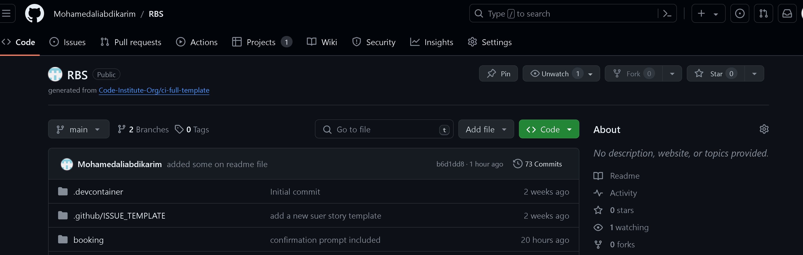

# To create a local clone of a project

1. Get the Repository URL:

- Follow the same steps as before to copy the repository URL from GitHub.

2 .Clone the Repository:

- Open VS Code on your local machine.
- Open the Command Palette by pressing Ctrl+Shift+P (Windows/Linux) or Cmd+Shift+P (Mac).
- Type "Git: Clone" and press Enter.
- Paste the copied repository URL and press Enter.
- Choose the directory where you want to clone the repository and press Enter.

3. Install Requirements:

- After cloning the repository, open a terminal in VS Code.
 - Navigate into the cloned directory.
  - Run the command pip3 install -r requirements.txt to install the required dependencies.

4 . Set up Environment Variables:

- Follow the same steps as before to create an env.py file in the root directory of the project.
-  Add the required environment variables to the env.py file as shown before.

5. Migration and Server Setup:

- Open a terminal in VS Code and navigate into the project directory.
-  Run the migration commands:

   - python3 manage.py migrate
    - python3 manage.py runserver
- Optionally, if needed, create a superuser using:

  - python3 manage.py createsuperuser

  

 local clone 

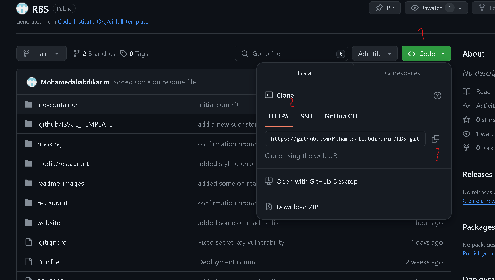

# Credits

### Content
Readmes to follow: https://github.com/lucia2007/tennis_buddies?tab=readme-ov-file.

- Parts of the code

    - [youtube ](https://www.youtube.com/watch?v=-9dhCQ7FdD0&list=PL_6Ho1hjJirn8WbY4xfVUAlcn51E4cSbY).

     - [youtube ](https://www.youtube.com/watch?v=TuXFAl8aMvc).

    - [youtube ](https://www.youtube.com/watch?v=t10QcFx7d5k).

 - Heroku postSQL

   - [youtube ](https://www.youtube.com/watch?v=2OHc5EqfX5g&t=928s).

 - Secret Key

   - [youtube ](https://www.youtube.com/watch?v=BuOlpKA2cNs).

   ## Media
   - [google ](https://www.google.com/search?q=restaurant+-boutique-header-bg-jpy&sca_esv=ac096cdb2ad9c657&sca_upv=1&udm=2&biw=1365&bih=666&ei=u8hBZrbYO72HwPAPpsK6wAM&ved=0ahUKEwj2odnJlIqGAxW9AxAIHSahDjgQ4dUDCA8&uact=5&oq=restaurant+-boutique-header-bg-jpy&gs_lp=Egxnd3Mtd2l6LXNlcnAiInJlc3RhdXJhbnQgLWJvdXRpcXVlLWhlYWRlci1iZy1qcHlI-29Qhx9YkFxwAXgAkAEAmAE3oAHNA6oBATm4AQPIAQD4AQGYAgCgAgCYAwCIBgGSBwCgB5UD&sclient=gws-wiz-serp#vhid=g_CUYDxHfUlXnM&vssid=mosaic). - bakcground image

# Acknowledgements

This website stands as the culmination of my efforts during the Portfolio 4  Project for the Full Stack Software Developer (e-Commerce) Diploma at the Code Institute. I extend my heartfelt gratitude to my mentor, Precious Ijege, the invaluable Slack community, and everyone at the Code Institute for their unwavering assistance and support throughout this journey. While Wawas Woods is a fictitious entity, its presence is tangible in every aspect except for the business title. At present, it is more than just a project – it is a passion!

   

